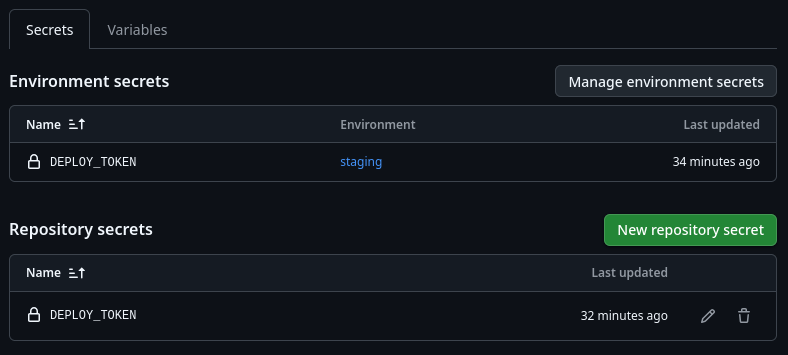

# Практична робота №5
Цей проект демонструє роботу CI/CD пайплайну в GitHub Actions.

## Список використаних людських ресурсів:
- Мирослав Терьохін
- Андрій Солдатов
- Влад Колчанов
- Артємій Виговський
- Нікіта Ніжинський
- Максим Стетий
- Максим Гейко

## Результати

> **Runs** with all **jobs** and List of **Artifacts**

> **Environments** page

> **Secrets** options

> **Variables** options

## Функціонал
- Простий Hello World додаток
- Автоматичне тестування
- Збірка проекту
- Імітація деплою

## CI/CD Features
- ✅ Автоматичні тести
- ✅ Кешування залежностей
- ✅ Артефакти тестів та збірки
- ✅ Environment variables
- ✅ Secrets management
- ✅ Умовний деплой на staging
